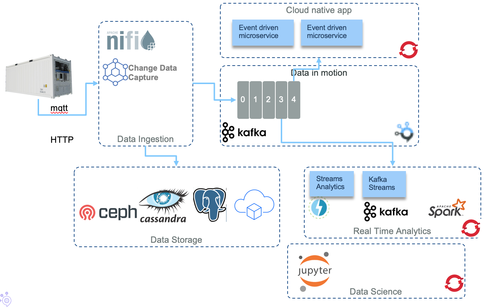
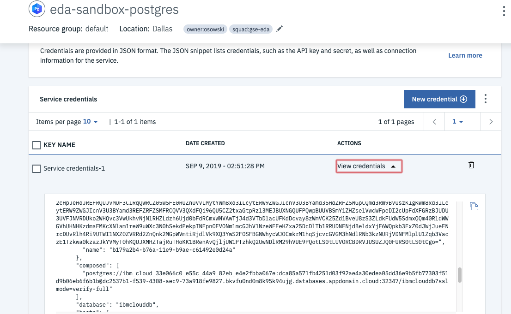
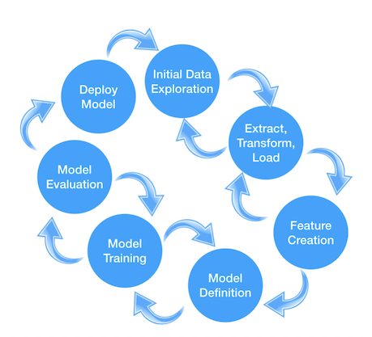

# Reefer Predictive Maintenance Solution

This project is to demonstrate how to perform real time analytics, like predictive maintenance of Reefer container in the shipping industry, using Reefer container metric event stream. 

!!! note:
        This project is part of the [reference implementation solution](https://ibm-cloud-architecture.github.io/refarch-kc/)  to demonstrate the IBM [event driven reference architecture](https://ibm-cloud-architecture.github.io/refarch-eda).

The runtime environment in production may look like in the following diagram:



The Reefer container is a IoT device, which emits container metrics every 15 minutes via the MQTT protocol. The first component receiving those messages is Apache Nifi to transform the metrics message to a kafka event. Kafka is used as the event backbone and event sourcing so microservices, deployed on openshift, can consume and publish messages.

For persistence reason, we may leverage big data type of storage like Cassandra to persist the container metrics over a longer time period. This datasource is used by the Data Scientists to do its data preparation and build training and test sets and build model.

Data scientists can run Jupyter lab on OpenShift and build a model to be deployed as python microservice, consumer of kafka Reefer metrics events. The action will be to change the state of the Reefer entity via an events to the `containers` topic. 

## Component view

For the minimum viable demonstration the runtime components looks like in the figure below:


1. A web app, deployed on Openshift, is running a simulator to simulate the generation of Reefer container metrics while the container is at sea or during end to end transportation. The app exposes a simple POST operation with a control object to control the simulation. Here is an example of such control.json

    ```json
    { 'containerID': 'c100',
    'simulation': 'co2sensor',
    'nb_of_records': 1000,
    'good_temperature': 4.4
    }
    ```

    See [this section to build and deploy](#the-simulator-as-webapp) the simulator web app.

1. A curl script will do the post of this json object. [See this paragraph.](#test-sending-a-simulation-control-to-the-post-api)
1. The metrics events are sent to the `containerMetrics` topic in Kafka.
1. The predictive scoring is a consumer of such events, read one event at a time and call the model internally, then sends a new event when maintenance is required. [See the note](/#the-predictive-scoring-agent) for details.
1. The maintenance requirement is an event in the `containers` topic.
1. The last element is to trace the container maintenance event, in real application, this component should trigger a business process to get human performing the maintenance. The [following repository]() is the microservice we could use on as this component, but we have a simple consumer in the `consumer` folder.

For the machine learning environment we can use csv file as input data or postgresql database. The environment looks like in the figure below:


The simulator can run as a standalone tool to create training and test data to be saved in a remote postgresql database. We use postgresql as a service on IBM cloud. The service has credential with URL and SSL certificate.



## Pre-requisites to build and run this solution

Start by cloning this project using the command:

```
git clone https://github.com/ibm-cloud-architecture/refarch-reefer-ml
```

### Be sure to have Event Stream or Kafka running somewhere

We recommend creating the Event Stream service using the [IBM Cloud catalog](https://cloud.ibm.com/catalog/services/event-streams), you can also read our [quick article](https://ibm-cloud-architecture.github.io/refarch-eda/deployments/eventstreams/es-ibm-cloud/) on this event stream cloud deployment. We also have deployed Event Stream on Openshift running on-premise servers following the product documentation [here](https://ibm.github.io/event-streams/installing/installing-openshift/). 

The following diagram illustrates the topics configured in IBM Cloud Event Stream service:


With IBM Cloud deployment use the service credentials to create new credentials to get the Kafka brokers list, the admin URL and the api key needed to authenticate the consumers or producers.

For Event Streams on Openshift deployment, click to the `connect to the cluster` button to get the broker URL and to generate the API key: select the option to generate the key for all topics.


### Provision a Postgresql service

Use the [product documentation](https://cloud.ibm.com/docs/services/databases-for-postgresql) to provision your own service. Define service credential and use the `composed` url, the database name and the SSL certificate. Use the following commands to get the certificate:
        
```shell
ibmcloud login
ibmcloud cdb cacert <database deployment name>
```  

### Set environment variables

As part of the [12 factors practice](https://12factor.net/), we externalize the end points configuration in environment variables. We are providing a script template (`scripts/setenv-tmp.sh`) to set those variables for your local development. Rename this file as `setenv.sh`. This file is git ignored, to do not share keys and passwords in public domain.

The variables help the different code in the solition to access the Event Stream broker cluster and the Postgresql service running on IBM Cloud.

### Building a python development environment as docker image

To avoid impacting our laptop environment (specially macbook which use python), we use a dockerfile to get the basic of python 3.7.x and the python modules like kafka, http requests, pandas, sklearn, pytest... we need to develop and test the different python code of this solution. To build your python image with all the needed libraries, use the following commands:

```
cd docker
docker build -f docker-python-tools -t ibmcase/python .
```

To use this python environment you can use the script: `startPythonEnv`. If you run with Event Stream on the cloud and Postgresql  on your laptopn use the LOCAL argument, use  IBMCLOUD otherwise:

```
# refarch-reefer-ml project folder
./startPythonEnv.sh IBMCLOUD
```

### Build the docker image for Jupyter notebook

We are using a special version of conda to add the postgresql and kafka libraries for python so we can access postgresql or kafka from notebook. The Dockerfile may use a `cert.pem` file, which contains the postgres certificate so the notebook can connect to postgresql service wiith SSL connection. 

```
cd docker 
docker build -f docker-jupyter-tool -t ibmcase/jupyter .
```

To run this jupyter server run:

```
# refarch-reefer-ml project folder
./startJupyterServer.sh IBMCLOUD
```

## Project approach

As a major step of developing a machine learning or analytics model, it is important to have good data. In this project we are adopting a lightweight approach to develop this minimum viable product. The activities are summarized in this diagram:



We encourage you to read [this article](https://ibm-cloud-architecture.github.io/refarch-data-ai-analytics/methodology/lightweight/) for more insight on the methodology.

### 1- Collect data

We are using a simulator to generate data and go over the detail of how to collect data in [this article](collect-data.md).

If you generate the training and test sets as file, put this .csv file under the `ml/data/` folder.

If you use postgresql as data source be sure to have set the POSTGRES environment variables in the `setenv.sh` script.

### 2- Define the predictive scoring model 

Predictive maintenance and anomaly detection are complex problems to address. We do not pretend to address those complex problems in this repository, as we focus in putting in place the end to end creation and deployment of the model. To review the problem of predictive maintenance read [this article.](predictive-maintenance.md)

*If you want to contribute to build a better model, we are looking for contributors*.

To build the model and work on the data, we will use a local version of **Jupyter** notebook to load the logistic regression nodebook from the `ml` folder. 

We have two types of notebook

1. Start a jupyter server using our docker image and a postgresql in IBM cloud.

    ```
    pwd

    ./startJupyterServer IBMCLOUD  or LOCAL
    ```

1. Then open a web browser to `http://localhost:8888?token=<sometoken>` go under `work/ml` folder.
1. Open one of the model:
    * the `model_logistic_regression.ipynb` to work on data set saved in the `ml/data/telemetries.csv` file. 
    * the `model_logistic_regression-pg.ipynb` to work on data saved in postgresql running on IBM Cloud.
    
    The notebooks include comments to explain how the model is done. We use logistic regression to build a binary classification (maintenance required or not), as the data are simulated, and the focus is not in the model building, but more on the end to end process.

    The notebook persists the trained model as a pickle file so it can be loaded by a python module or another notebook.

    For more information on using the Jupyter notebook, here is a [product documentation](https://jupyter-docker-stacks.readthedocs.io/en/latest/index.html).

1. Use the model in another notebook: We can use a second notebook to test the model with one telemetry record using the pickle serialized model. The notebook is named `predictMaintenance.ipynb`.

### 3- Deploy the model

We have two types of deployment:

* Run the model in a web app to support REST calls.
* Run the model in an agent, consumer of reefer telemetry events and producer of container maintenance event.

The `scoring` folder includes an `eventConsumer` folder for the agent implementation and a `webapp` for the Flask and REST end point wrapper. 

In this solution we use the agent implementation.

So you need to copy the generated pickle file to the `eventConsumer/domain` folder.

### 4- Deploy each service
